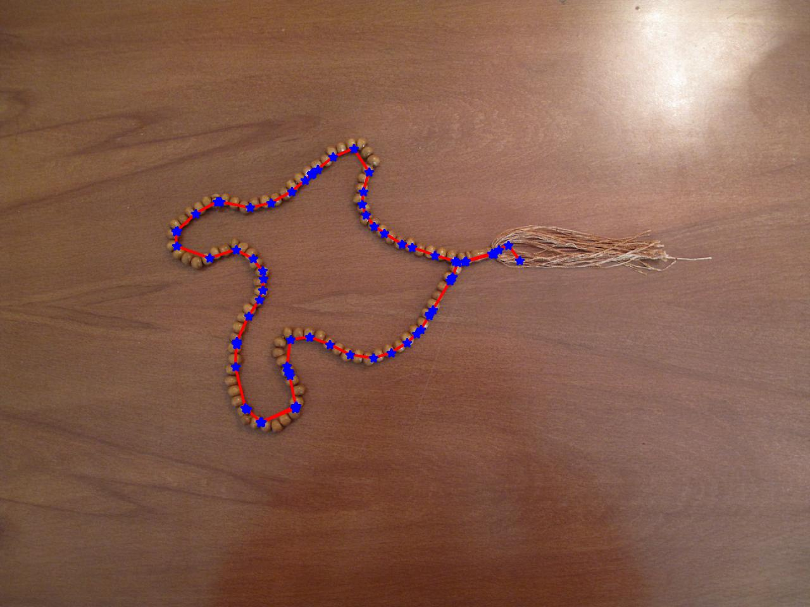

# Active Contours for Object Detection

## Table of Contents
1. [Introduction](#introduction)
2. [Requirements](#requirements)
3. [Usage](#usage)
4. [Method Overview](#method-overview)
5. [Results](#results)
6. [License](#license)

## <a name="introduction"></a>Introduction
<p align="center">
<br>
<br>
this is the final result of active contour detection

</p>

This project implements active contours, which are energy-based models used for object detection. Active contours aim to capture objects by maximizing the gradient and the distance of each point, along with the second-order derivatives at each step. The provided code performs active contour detection on an input image.

## <a name="requirements"></a>Requirements

Make sure you have the following dependencies installed:

- NumPy
- OpenCV (cv2)
- Matplotlib
- scikit-image

You can install these dependencies using pip:

```shell
pip install numpy opencv-python matplotlib scikit-image
```

## <a name="usage"></a>Usage

1. Place the image you want to process in the same directory as the script and name it "tasbih.jpg".
2. Run the script.
3. Select one of the options by entering its corresponding number:
   - Option 1: Manually select points by double-clicking on the image. Press 'e' to stop selecting points.
   - Option 2: Use default points generated automatically.
4. The script will perform active contour detection on the image and save the intermediate results in the "pics" directory.
5. The final result will be saved as "res11.jpg".
6. A video file named "contour.mp4" will be generated, showing the progressive contour detection.

## <a name="method-overview"></a>Method Overview

1. Load and preprocess the input image.
2. Prompt the user to select points on the object of interest manually or use default points.
3. Calculate the gradient of the image using the Sobel operator.
4. Apply thresholding to the gradient image using Otsu's method to obtain a binary mask.
5. Smooth the gradient image using a Gaussian filter.
6. Initialize parameters and variables for the active contour algorithm.
7. Perform iterations of the active contour algorithm:
   - Calculate the energy of moving each point in all possible directions.
   - Find the best direction for each point based on the energy.
   - Update the positions of the points accordingly.
   - Save intermediate results at a certain frame rate.
8. Save the final contour result as an image and create a video from the intermediate results.

## <a name="results"></a>Results

The script generates intermediate images in the "pics" directory, showing the progressive contour detection. The final result is saved as "res11.jpg". Additionally, a video file named "contour.mp4" is created, demonstrating the contour detection process.

## <a name="license"></a>License

This project is licensed under the [MIT License](LICENSE).